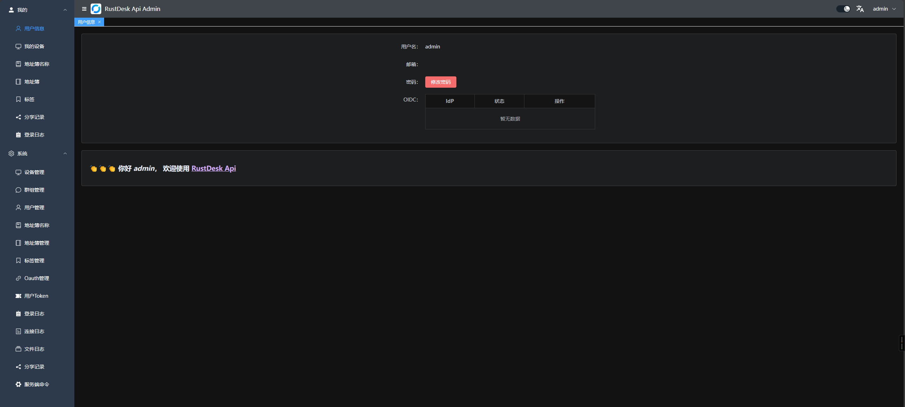
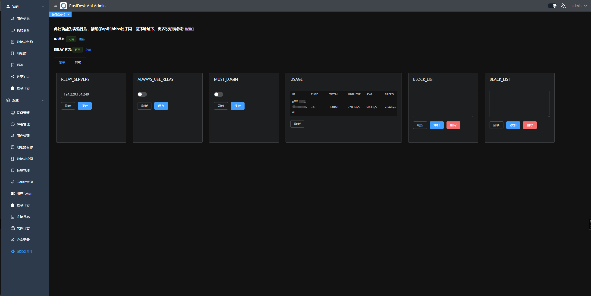

# 关于此分支


[](https://github.com/lejianwen/rustdesk-server/actions/workflows/build.yaml)

- 解决当客户端登录了`API`账号时链接超时的问题
- s6镜像添加了`API`支持；从 `v0.2.0` 起，API base image 改为 `czyt/rustdesk-console:latest`
- 是否必须登录才能链接， `MUST_LOGIN` 默认为 `N`，设置为 `Y` 则必须登录才能链接
- `RUSTDESK_API_JWT_KEY`，设置后会通过`JWT`校验token的合法性
- 支持client websocket (client >= 1.4.1)
- 内嵌 WebClient 支持 `RUSTDESK_API_RUSTDESK_WS_HOST`：设置后走 `<ws-host>/ws/id` 和 `<ws-host>/ws/relay`；不设置则继续按 `id-server + 2`、`relay-server + 2` 连接 `21118/21119`

## docker镜像地址

- s6 镜像 [czyt/rustdesk-server-s6](https://hub.docker.com/r/czyt/rustdesk-server-s6)

```yaml
 networks:
   rustdesk-net:
     external: false
 services:
   rustdesk:
     ports:
       - 21114:21114
       - 21115:21115
       - 21116:21116
       - 21116:21116/udp
       - 21117:21117
       - 21118:21118
       - 21119:21119
     image: czyt/rustdesk-server-s6:latest
     environment:
       - RELAY=<relay_server[:port]>
       - ENCRYPTED_ONLY=1
       - MUST_LOGIN=N
       - TZ=Asia/Shanghai
       - RUSTDESK_API_RUSTDESK_ID_SERVER=<id_server[:21116]>
       - RUSTDESK_API_RUSTDESK_RELAY_SERVER=<relay_server[:21117]>
       - RUSTDESK_API_RUSTDESK_API_SERVER=http://<api_server[:21114]>
       - RUSTDESK_API_RUSTDESK_WS_HOST=wss://<webclient_ws_host>
       - RUSTDESK_API_KEY_FILE=/data/id_ed25519.pub
       - RUSTDESK_API_JWT_KEY=xxxxxx # jwt key
     volumes:
       - /data/rustdesk/server:/data
       - /data/rustdesk/api:/app/data #将数据库挂载
     networks:
       - rustdesk-net
     restart: unless-stopped
       
```

- 普通镜像 [lejianwen/rustdesk-server](https://hub.docker.com/r/lejianwen/rustdesk-server)

## v0.2.0 API base image 变化

从 `v0.2.0` 起，S6 镜像不再基于 `lejianwen/rustdesk-api:latest` 构建，改为基于 `czyt/rustdesk-console:latest` 构建。`czyt/rustdesk-console` 提供 Rust 重写后的 API server，S6 overlay 仍由本仓库的 `docker/Dockerfile` 安装，并继续负责同时拉起 `hbbs`、`hbbr` 和 API 服务。

API 服务在 S6 中的启动命令为：

```sh
cd /app
./rustdesk-console -c ./conf/config.yaml
```

API 数据目录保持为 `/app/data`，默认 SQLite 数据库路径为 `/app/data/rustdeskapi.db`。因此现有挂载方式仍然可用：

```yaml
volumes:
  - /data/rustdesk/api:/app/data
```

最终镜像入口仍为 S6 的 `/init`，base 镜像中的 `CMD` 会被清空，避免 `rustdesk-console` 的默认启动命令作为参数传给 `/init`。

## WebClient + Cloudflare Tunnel

内嵌 WebClient 需要浏览器能访问 hbbs/hbbr 的 websocket。默认情况下它会从
`RUSTDESK_API_RUSTDESK_ID_SERVER` 推导 `21118`，从
`RUSTDESK_API_RUSTDESK_RELAY_SERVER` 推导 `21119`。

如果你把 API `21114` 通过 Cloudflare Tunnel 暴露出去，也可以把 WebClient websocket
放在同一个公网域名的子路径下：

```text
https://rd.example.com          -> rustdesk-console 21114
wss://rd.example.com/ws/id      -> hbbs websocket 21118
wss://rd.example.com/ws/relay   -> hbbr websocket 21119
```

容器环境变量这样配：

```env
RUSTDESK_API_RUSTDESK_API_SERVER=https://rd.example.com
RUSTDESK_API_RUSTDESK_WS_HOST=https://rd.example.com
RUSTDESK_API_RUSTDESK_ID_SERVER=<原生客户端可访问的地址:21116>
RUSTDESK_API_RUSTDESK_RELAY_SERVER=<原生客户端可访问的地址:21117>
```

`RUSTDESK_API_RUSTDESK_WS_HOST` 设置后，WebClient 固定使用
`<ws-host>/ws/id` 和 `<ws-host>/ws/relay`；不设置时保持旧逻辑，继续直连
`21118/21119`。`ws-host` 可以写 `https://rd.example.com` 或
`wss://rd.example.com`，WebClient 会用 websocket 协议连接。

Cloudflare Zero Trust Dashboard 中可以配置 3 条 Public Hostname 规则：

| Hostname | Path | Type | URL |
| --- | --- | --- | --- |
| `rd.example.com` | `/ws/id` | `HTTP` | `rustdesk:21118` |
| `rd.example.com` | `/ws/relay` | `HTTP` | `rustdesk:21119` |
| `rd.example.com` | 空 | `HTTP` | `rustdesk:21114` |

如果用本地 `cloudflared` 配置文件，ingress 示例：

```yaml
tunnel: <Tunnel-UUID>
credentials-file: /etc/cloudflared/<Tunnel-UUID>.json

ingress:
  - hostname: rd.example.com
    path: ^/ws/id/?$
    service: http://rustdesk:21118
  - hostname: rd.example.com
    path: ^/ws/relay/?$
    service: http://rustdesk:21119
  - hostname: rd.example.com
    service: http://rustdesk:21114
  - service: http_status:404
```

这里的 `rustdesk` 是 docker compose 里的服务名；如果 cloudflared 不在同一个
docker network，就改成它能访问到的内网 IP。Tunnel 到容器内部用 `http://` 即可，
浏览器到 Cloudflare 才是 `https://` / `wss://`。

注意：这只解决 WebClient 的 `21118/21119` websocket。RustDesk 原生客户端仍然需要
能访问 `21115`、`21116/tcp`、`21116/udp`、`21117`，按你的现有端口转发方式处理。


# API功能截图





API 服务现由 `czyt/rustdesk-console:latest` 镜像提供。


--- 

<p align="center">
  <a href="#如何自行构建">自行构建</a> •
  <a href="#Docker-镜像">Docker</a> •
  <a href="#基于-S6-overlay-的镜像">S6-overlay</a> •
  <a href="#如何创建密钥">密钥</a> •
  <a href="#deb-套件">Debian</a> •
  <a href="#ENV-环境参数">环境参数</a><br>
  [<a href="README-EN.md">English</a>] | [<a href="README-DE.md">Deutsch</a>] | [<a href="README-NL.md">Nederlands</a>] | [<a href="README-TW.md">繁体中文</a>]<br>
</p>

# RustDesk Server Program


[**下载**](https://github.com/lejianwen/rustdesk-server/releases)

[**说明文件**](https://rustdesk.com/docs/zh-cn/self-host/)

[**Configuration & environment variables**](docs/environment-variables.md)

[**FAQ**](https://github.com/rustdesk/rustdesk/wiki/FAQ)

自行搭建属于你的RustDesk服务器,所有的一切都是免费且开源的

## 如何自行构建

```bash
cargo build --release
```

执行后会在target/release目录下生成三个对应平台的可执行程序

- hbbs - RustDesk ID/会和服务器
- hbbr - RustDesk 中继服务器
- rustdesk-utils - RustDesk 命令行工具

您可以在 [releases](https://github.com/lejianwen/rustdesk-server/releases) 页面中找到最新的服务端软件。

如果您需要额外的功能支持，[RustDesk 专业版服务器](https://rustdesk.com/pricing.html) 获取更适合您。

如果您想开发自己的服务器，[rustdesk-server-demo](https://github.com/rustdesk/rustdesk-server-demo) 应该会比直接使用这个仓库更简单快捷。

## Configuration

`hbbs` and `hbbr` can be configured with command-line flags, environment
variables, or an `.env` / config file. Run `hbbs --help` or `hbbr --help` to see
the available flags.

The most common options:

| Option | Flag | Env var | Applies to | Purpose |
| --- | --- | --- | --- | --- |
| Key | `-k` | `KEY` | hbbs, hbbr | `hbbs` loads/generates one by default |
| Bind address | `-b` | `BIND` | hbbs, hbbr | Local IP address to listen on (default: all interfaces; requires 1.1.17+) |
| Port | `-p` | `PORT` | hbbs, hbbr | Listening port (hbbs `21116`, hbbr `21117`) |
| Relay servers | `-r` | `RELAY-SERVERS` | hbbs | Override when the relay uses a different address or a non-standard port |
| Force relay | — | `ALWAYS_USE_RELAY` | hbbs | `Y` disables direct connections |
| Log level | — | `RUST_LOG` | hbbs, hbbr | e.g. `debug` (default `info`) |

See **[docs/environment-variables.md](docs/environment-variables.md)** for the
full list of variables, the file/flag/env precedence rules, database and relay
bandwidth tuning, Docker image variables, and examples.

## Docker 镜像

Docker镜像会在每次 GitHub 发布新的release版本时自动构建。我们提供两种类型的镜像。

### Classic 传统镜像

这个类型的镜像是基于 `ubuntu-20.04` 进行构建，镜像仅包含两个主要的可执行程序（`hbbr` 和 `hbbs`）。它们可以通过以下tag在 [Docker Hub](https://hub.docker.com/r/lejianwen/rustdesk-server/) 上获得：

| 架构      | image:tag                                 |
|---------| ----------------------------------------- |
| amd64   | `lejianwen/rustdesk-server:latest`         |
| arm64v8 | `lejianwen/rustdesk-server:latest-arm64v8` |

您可以使用以下命令，直接通过 ``docker run`` 來启动这些镜像：

```bash
docker run --name hbbs --net=host -v "$PWD/data:/root" -d lejianwen/rustdesk-server:latest hbbs -r <relay-server-ip[:port]> 
docker run --name hbbr --net=host -v "$PWD/data:/root" -d lejianwen/rustdesk-server:latest hbbr 
```

或不使用 `--net=host` 参数启动， 但这样 P2P 直连功能将无法工作。

对于使用了 SELinux 的系统，您需要将 ``/root`` 替换为 ``/root:z``，以保证容器的正常运行。或者，也可以通过添加参数 ``--security-opt label=disable`` 来完全禁用 SELinux 容器隔离。

```bash
docker run --name hbbs -p 21115:21115 -p 21116:21116 -p 21116:21116/udp -p 21118:21118 -v "$PWD/data:/root" -d lejianwen/rustdesk-server:latest hbbs -r <relay-server-ip[:port]> 
docker run --name hbbr -p 21117:21117 -p 21119:21119 -v "$PWD/data:/root" -d lejianwen/rustdesk-server:latest hbbr 
```

`relay-server-ip` 参数是运行这些容器的服务器的 IP 地址（或 DNS 名称）。如果你不想使用 **21117** 作为 `hbbr` 的服务端口,可使用可选参数 `port` 进行指定。

您也可以使用 docker-compose 进行构建,以下为配置示例：

```yaml
version: '3'

networks:
  rustdesk-net:
    external: false

services:
  hbbs:
    container_name: hbbs
    ports:
      - 21115:21115
      - 21116:21116
      - 21116:21116/udp
      - 21118:21118
    image: lejianwen/rustdesk-server:latest
    command: hbbs -r rustdesk.example.com:21117
    volumes:
      - ./data:/root
    networks:
      - rustdesk-net
    depends_on:
      - hbbr
    restart: unless-stopped

  hbbr:
    container_name: hbbr
    ports:
      - 21117:21117
      - 21119:21119
    image: lejianwen/rustdesk-server:latest
    command: hbbr
    volumes:
      - ./data:/root
    networks:
      - rustdesk-net
    restart: unless-stopped
```

编辑第16行来指定你的中继服务器 （默认端口监听在 21117 的那一个）。 如果需要的话，您也可以编辑 volume 信息  (第 18 和 33 行)。

（感谢 @lukebarone 和 @QuiGonLeong 协助提供的 docker-compose 配置示例）

## 基于 S6-overlay 的镜像

> 从 `v0.2.0` 起，这些镜像基于 `czyt/rustdesk-console:latest` 构建，并添加可执行程序（hbbr 和 hbbs）以及 [S6-overlay](https://github.com/just-containers/s6-overlay)。 它们可以使用以下tag在 [Docker hub](https://hub.docker.com/r/czyt/rustdesk-server-s6/) 上获取：


| 架構      | version | image:tag                                    |
| --------- | ------- | -------------------------------------------- |
| multiarch | latest  | `czyt/rustdesk-server-s6:latest`         |
| amd64     | latest  | `czyt/rustdesk-server-s6:latest-amd64`   |
| arm64v8   | latest  | `czyt/rustdesk-server-s6:latest-arm64v8` |
| multiarch | v0      | `czyt/rustdesk-server-s6:v0`             |
| amd64     | v0      | `czyt/rustdesk-server-s6:v0-amd64`       |
| arm64v8   | v0      | `czyt/rustdesk-server-s6:v0-arm64v8`     |
| multiarch | v0.2.0  | `czyt/rustdesk-server-s6:v0.2.0`         |
| amd64     | v0.2.0  | `czyt/rustdesk-server-s6:v0.2.0-amd64`   |
| arm64v8   | v0.2.0  | `czyt/rustdesk-server-s6:v0.2.0-arm64v8` |

从 `v0.2.0` 起，S6 镜像依赖 `czyt/rustdesk-console` 作为 API base image，因此仅发布 `amd64` 和 `arm64v8`。Classic 镜像仍按独立流程构建。

强烈建议您使用`major version` 或 `latest` tag 的 `multiarch` 架构的镜像。

S6-overlay 在此处作为监控程序，用以保证两个进程的运行，因此使用此镜像，您无需运行两个容器。

您可以使用 `docker run` 命令直接启动镜像，如下：

```bash
docker run --name rustdesk-server \ 
  --net=host \
  -e "RELAY=rustdeskrelay.example.com" \
  -e "ENCRYPTED_ONLY=1" \
  -v "$PWD/data:/data" -d czyt/rustdesk-server-s6:latest
```

或刪去 `--net=host` 参数， 但 P2P 直连功能将无法工作。

```bash
docker run --name rustdesk-server \
  -p 21115:21115 -p 21116:21116 -p 21116:21116/udp \
  -p 21117:21117 -p 21118:21118 -p 21119:21119 \
  -e "RELAY=rustdeskrelay.example.com" \
  -e "ENCRYPTED_ONLY=1" \
  -v "$PWD/data:/data" -d czyt/rustdesk-server-s6:latest
```

或着您也可以使用 docker-compose 文件:

```yaml
version: '3'

services:
  rustdesk-server:
    container_name: rustdesk-server
    ports:
      - 21114:21114
      - 21115:21115
      - 21116:21116
      - 21116:21116/udp
      - 21117:21117
      - 21118:21118
      - 21119:21119
    image: czyt/rustdesk-server-s6:latest
    environment:
      - "RELAY=rustdesk.example.com:21117"
      - "ENCRYPTED_ONLY=1"
    volumes:
      - ./data:/data
    restart: unless-stopped
```

对于此容器镜像，除了在下面的环境变量部分指定的变量之外，您还可以使用以下`环境变量`

| 环境变量           | 是否可选 | 描述                       |
|----------------|------|--------------------------|
| RELAY          | 否    | 运行此容器的宿主机的 IP 地址/ DNS 名称 |
| ENCRYPTED_ONLY | 是    | 如果设置为 **"1"**，将不接受未加密的连接。 |
| KEY_PUB        | 是    | 密钥对中的公钥（Public Key）      |
| KEY_PRIV       | 是    | 密钥对中的私钥（Private Key）     |

###  基于 S6-overlay 镜像的密钥管理

您可以将密钥对保存在 Docker volume 中，但我们建议不要将密钥写入文件系統中；因此，我们提供了一些方案。

在容器启动时，会检查密钥对是否存在（`/data/id_ed25519.pub` 和 `/data/id_ed25519`），如果其中一個密钥不存在，则会从环境变量或 Docker Secret 中重新生成它。
然后检查密钥对的可用性：如果公钥和私钥不匹配，容器将停止运行。
如果您未提供密钥，`hbbs` 将会在默认位置生成一个。

#### 使用 ENV 存储密钥对

您可以使用 Docker 环境变量來存储密钥。如下：

```bash
docker run --name rustdesk-server \ 
  --net=host \
  -e "RELAY=rustdeskrelay.example.com" \
  -e "ENCRYPTED_ONLY=1" \
  -e "DB_URL=/db/db_v2.sqlite3" \
  -e "KEY_PRIV=FR2j78IxfwJNR+HjLluQ2Nh7eEryEeIZCwiQDPVe+PaITKyShphHAsPLn7So0OqRs92nGvSRdFJnE2MSyrKTIQ==" \
  -e "KEY_PUB=iEyskoaYRwLDy5+0qNDqkbPdpxr0kXRSZxNjEsqykyE=" \
  -v "$PWD/db:/db" -d czyt/rustdesk-server-s6:latest
```

```yaml
version: '3'

services:
  rustdesk-server:
    container_name: rustdesk-server
    ports:
      - 21114:21114
      - 21115:21115
      - 21116:21116
      - 21116:21116/udp
      - 21117:21117
      - 21118:21118
      - 21119:21119
    image: czyt/rustdesk-server-s6:latest
    environment:
      - "RELAY=rustdesk.example.com:21117"
      - "ENCRYPTED_ONLY=1"
      - "DB_URL=/db/db_v2.sqlite3"
      - "KEY_PRIV=FR2j78IxfwJNR+HjLluQ2Nh7eEryEeIZCwiQDPVe+PaITKyShphHAsPLn7So0OqRs92nGvSRdFJnE2MSyrKTIQ=="
      - "KEY_PUB=iEyskoaYRwLDy5+0qNDqkbPdpxr0kXRSZxNjEsqykyE="
    volumes:
      - ./db:/db
    restart: unless-stopped
```

#### 使用 Docker Secret 來保存密钥对

您还可以使用 Docker Secret 來保存密钥。
如果您使用 **docker-compose** 或 **docker swarm**，推荐您使用。
只需按照以下示例操作：

```bash
cat secrets/id_ed25519.pub | docker secret create key_pub -
cat secrets/id_ed25519 | docker secret create key_priv -
docker service create --name rustdesk-server \
  --secret key_priv --secret key_pub \
  --net=host \
  -e "RELAY=rustdeskrelay.example.com" \
  -e "ENCRYPTED_ONLY=1" \
  -e "DB_URL=/db/db_v2.sqlite3" \
  --mount "type=bind,source=$PWD/db,destination=/db" \
  czyt/rustdesk-server-s6:latest
```

```yaml
version: '3'

services:
  rustdesk-server:
    container_name: rustdesk-server
    ports:
      - 21114:21114
      - 21115:21115
      - 21116:21116
      - 21116:21116/udp
      - 21117:21117
      - 21118:21118
      - 21119:21119
    image: czyt/rustdesk-server-s6:latest
    environment:
      - "RELAY=rustdesk.example.com:21117"
      - "ENCRYPTED_ONLY=1"
      - "DB_URL=/db/db_v2.sqlite3"
    volumes:
      - ./db:/db
    restart: unless-stopped
    secrets:
      - key_pub
      - key_priv

secrets:
  key_pub:
    file: secrets/id_ed25519.pub
  key_priv:
    file: secrets/id_ed25519      
```

## 如何生成密钥对

加密需要一对密钥；您可以按照前面所述提供它，但需要一个工具去生成密钥对。

您可以使用以下命令生成一对密钥：

```bash
/usr/bin/rustdesk-utils genkeypair
```

如果您沒有（或不想）在系统上安装 `rustdesk-utils` 套件，您可以使用 Docker 执行相同的命令：

```bash
docker run --rm --entrypoint /usr/bin/rustdesk-utils  czyt/rustdesk-server-s6:latest genkeypair
```

运行后的输出内容如下：

```text
Public Key:  8BLLhtzUBU/XKAH4mep3p+IX4DSApe7qbAwNH9nv4yA=
Secret Key:  egAVd44u33ZEUIDTtksGcHeVeAwywarEdHmf99KM5ajwEsuG3NQFT9coAfiZ6nen4hfgNICl7upsDA0f2e/jIA==
```

## .deb 套件

每个可执行文件都有单独的 .deb 套件可供使用，您可以在 [releases](https://github.com/lejianwen/rustdesk-server/releases) 页面中找到它們。
這些套件适用于以下发行版：

- Ubuntu 22.04 LTS
- Ubuntu 20.04 LTS
- Ubuntu 18.04 LTS
- Debian 11 bullseye
- Debian 10 buster

## ENV 环境变量

可以使用这些`环境变量`参数來配置 hbbs 和 hbbr。
您可以像往常一样指定参数，或者使用 .env 文件。

| 参数                    | 可执行文件         | 描述                                               |
|-----------------------|---------------|--------------------------------------------------|
| ALWAYS_USE_RELAY      | hbbs          | 如果设定为 **"Y"**，将关闭直接点对点连接功能                       |
| DB_URL                | hbbs          | 数据库配置                                            |
| DOWNGRADE_START_CHECK | hbbr          | 降级检查之前的延迟是啊尽（以秒为单位）                              |
| DOWNGRADE_THRESHOLD   | hbbr          | 降级检查的阈值（bit/ms）                                  |
| KEY                   | hbbs/hbbr     | 如果设置了此参数，将强制使用指定密钥对，如果设为 **"_"**，则强制使用任意密钥       |
| LIMIT_SPEED           | hbbr          | 速度限制（以Mb/s为单位）                                   |
| PORT                  | hbbs/hbbr     | 监听端口（hbbs为21116，hbbr为21117）                      |
| RELAY_SERVERS         | hbbs          | 运行hbbr的机器的IP地址/DNS名称（用逗号分隔）                      |
| RUST_LOG              | all           | 设置 debug level (error\|warn\|info\|debug\|trace) |
| SINGLE_BANDWIDTH      | hbbr          | 单个连接的最大带宽（以Mb/s为单位）                              |
| TOTAL_BANDWIDTH       | hbbr          | 最大总带宽（以Mb/s为单位）                                  |
